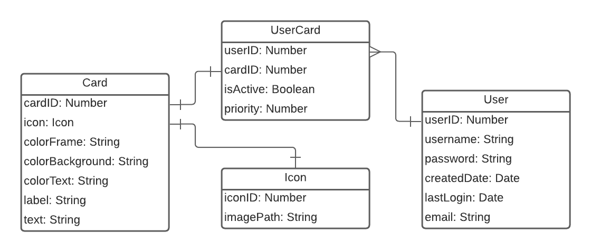

# PROJECT PLAN
The prototype design is detailed [here](https://www.figma.com/proto/PG9F2wrdrJnNiFiAIP0HGP).

## Primary Functionality:
It is a minimalistic 2-page application with simple markdown cards to track tasks.\
Initially designed for gaming achievements.

The page 1 is the main page by default.\
The page 2 can only be accessed via the "Settings" menu popup after a successful authentication.

---

## Page 1 Features:
1. Navigate Cards
2. Use Slider
3. Add Card
4. Archive Card
5. Rearrange Cards
6. Change Card Icon
7. Label Card
8. Write Card Text
9. Register
10. Login/Logout

---

### Navigate Cards
Cards can be navigated through the navigation bar.\
The navigation bar contains 3 empty card icons and an add icon by default.\
Each icon correspond to a card in the slider below.\
If there are 10 or more cards, the navigation bar enables a scrollbar instead of growing in width.

### Use Slider
In addition to the navigation bar, the slider can be used to switch the card view.\
The side arrows snap the previous or the next card to the view.

### Add Card
Clicking the add icon on the navigation bar adds one more card to the slider.

### Archive Card
From the card options via clicking its icon, the card can be deactivated and sent to the archive.\
It prevents the immediate permanent deletion of cards.\
The archive can be accessed in the page 2.

### Rearrange Cards
The cards can be rearranged by the drag and drop functionality of the icons on the navigation bar.

### Change Card Icon
User can change the icon of a card in the card options.\
The image resources should be placed and accessed from the server.\
The preferred dimensions of the icon image are 64x64 in pixel.

### Label Card
Each card is labeled with "'Card#' + number" by default.\
The card label can be customised by a double click on its container.\
The customised label can be saved and reflected by pressing enter or clicking outside of the container.\
The text follows the basic markdown syntax.

### Write Card Text
The main text container has the same functionality as the label.\
It can accept a multi-line string.\
Pressing enter in the editing mode does not exit the editing mode, but skips a line.\
The text follows the basic markdown syntax.

### Register
An account is created with a user ID, a password and an Email address.\
Incorrect passwords or already existing user IDs will produce a warning message in red.\
Registering a new account redirects to an authenticated session of the page 1.

### Login/Logout
An user ID and its password are required for an authentication.\
A successful authentication redirects to the page 1 in session.\
A failed authentication produces a warning in red: "Incorrect user ID or password".

---

## Page 2 Features:
1. Update User Information
2. Reactivate Card
3. Remove Card
4. Delete User Account

---

### Update User Information
User can update the account with new password or a new email address.\
In case of a new email address, it should not exist in the database.\
In either cases, the current password is required to save new data.\
User ID cannot be changed after the registration.

### Reactivate Card
In the card archive, user can see active and inactive cards.\
Cards can be reactivated/deactivated by a drag and drop method between two containers.

### Remove Card
Inactive cards can be discarded (removed) from the database.\
When clicking the "discard" button, a confirmation popup appears.

### Delete User Account
The account can be safely deleted from the database if the user chooses to.\
The procedure involves the user typing "DELETE" string into a form for a confirmation.\
The deletion is permanent.

---

## Secondary Functionality
- Link the admin's social media pages.
- Copy the url to the clipboard for sharing the application.
- See a progress bar for each card.
- Change the card color schemes using hex.
- Send a password reset email.
- Open the login popup when trying to add a card without authentication.\
(can only add cards in session after a successful authentication.)
- \<future option> Switch between light and dark themes.
- \<future option> Share the cards with other users.
- \<future option> Log in via Google, Facebook, or Steam.
- \<future option> Link a Steam ID.\
(requires an integration of SteamAPI)
- \<future option> Use a Steam game achievement icon as a card icon.

---

## Inital Data Models

\
(as of 2021-04-21)

### User
- It represents a user's account.
- userID (type: Number) is an autogenerated primary key (index) of User schema.
- username (type: String) accepts only simple lowercase characters and numbers.
- password (type: String) is encrypted.
- createdDate (type: Date) is autogenerated with the YYYY:MM:DD format.
- lastLogin (type: Date) is autogenerated with the YYYY:MM:DD:hh:mm:ss format.
- email (type: String) accepts the email "x@y.z" format.

### Card
- It represents a card entity.
- cardID (type: Number) is an autogenerated primary key (index) of Card schema.
- icon (type: Icon) is associated with an entity of the Icon schema.
- colorFrame (type: String) accepts a hex color code that starts with "#".
- colorBackground (type: String) accepts a hex color code that starts with "#".
- colorText (type: String) accepts a hex color code that starts with "#".
- label (type: String) is a single-line string.
- text (type: String) is a multi-line string.

### UserCard
- It associates a card entity with a user entity.
- It makes the application scalable with the future options.
- It has a compound index.
- userID (type: Number) is one of UserCard primary keys derived from a User entity.
- cardID (type: Number) is one of UserCard primary keys derived from a Card entity.
- isActive (type: Boolean) shows if the card is visible in the main page or archived.
- priority (type: Number) indicates the placement number in the navigation bar and the slider.

### Icon
- This entity contains a path to an image file.
- All Icon entities are created in the back-end initialisation.
- imagePath (type: String) is the location and the name of the file with its extension.